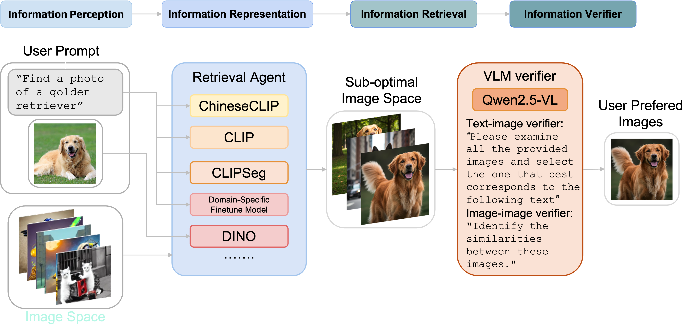
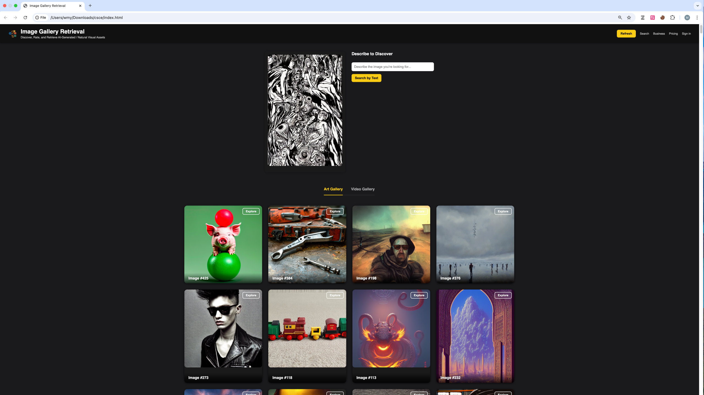

# Incorporating Multi-Modality and Latent Representations for Image Retrieval

**CSCE 670 — Information Storage & Retrieval**  
*Course Project*

**Team Members:**  
- Mingyang Wu, Yufeng Yang, Yu-Hsuan Ho, Yiming Xiao

## Architeture & webpage





## Environment

```bash
conda create -n retrieval python=3.10 -y
conda install pytorch==2.5.1 torchvision==0.20.1 torchaudio==2.5.1  pytorch-cuda=11.8 -c pytorch -c nvidia
conda install -c pytorch -c nvidia faiss-gpu

pip install opencv-python supervision xformers werkzeug click flask-cors

# VLM inference
pip install git+https://github.com/huggingface/transformers accelerate
pip install qwen-vl-utils[decord]
pip install -U flash-attn --no-build-isolation
```

## Retrieval Models

### Supported Text-Image Retrieval Models

- [x] CLIP
- [x] ChineseCLIP
- [x] CLIPSeg
- [x] AIGC Finetuning CLIP (you can download checkpoint here: [Google Drive](https://drive.google.com/drive/folders/1gzbKjAjS8ED1GMFFlfEiSXeGuzlCycl_?usp=drive_link))

### Supported Image-Image Retrieval Models

- [x] DinoV2


## Vision-Language Model verifers

- [x] QWen2.5-VL


## AIGC image Data Preparation

- [x] Qwen2.5 for word_tag


## data

## Implementation

1. Replace the IP addresses `"http://10.xx.xx.xx:5000"` and `"http://10.xx.xx.xx:5001"` in your local webpage files with the IP address of your remote server.

2. Data Preparation
We provide our generated AIGC images and videos, as well as collected data from public datasets, on [Google Drive](https://drive.google.com/drive/folders/1XByO7IQ6xKfMn0guhhmrAutU360Tc4iN?usp=drive_link).

```bash
# get diffusiondb data
# Download DiffusionDB data
cd datasets
mkdir -p datasets/DiffusionDB
mkdir -p datasets/DiffusionDB_raw

cd DiffusionDB_raw
wget "https://huggingface.co/datasets/poloclub/diffusiondb/resolve/main/diffusiondb-large-part-1/part-000001.zip"
wget "https://huggingface.co/datasets/poloclub/diffusiondb/resolve/main/diffusiondb-large-part-1/part-000002.zip"
wget "https://huggingface.co/datasets/poloclub/diffusiondb/resolve/main/diffusiondb-large-part-1/part-000003.zip"
wget "https://huggingface.co/datasets/poloclub/diffusiondb/resolve/main/diffusiondb-large-part-1/part-000004.zip"
wget "https://huggingface.co/datasets/poloclub/diffusiondb/resolve/main/diffusiondb-large-part-1/part-000005.zip"
wget "https://huggingface.co/datasets/poloclub/diffusiondb/resolve/main/diffusiondb-large-part-1/part-000006.zip"
wget "https://huggingface.co/datasets/poloclub/diffusiondb/resolve/main/diffusiondb-large-part-1/part-000007.zip"
wget "https://huggingface.co/datasets/poloclub/diffusiondb/resolve/main/diffusiondb-large-part-1/part-000008.zip"
wget "https://huggingface.co/datasets/poloclub/diffusiondb/resolve/main/diffusiondb-large-part-1/part-000009.zip"

cd ..
unzip DiffusionDB_raw/part-000001.zip -d ./DiffusionDB
unzip DiffusionDB_raw/part-000002.zip -d ./DiffusionDB
unzip DiffusionDB_raw/part-000003.zip -d ./DiffusionDB
unzip DiffusionDB_raw/part-000004.zip -d ./DiffusionDB
unzip DiffusionDB_raw/part-000005.zip -d ./DiffusionDB
unzip DiffusionDB_raw/part-000006.zip -d ./DiffusionDB
unzip DiffusionDB_raw/part-000007.zip -d ./DiffusionDB
unzip DiffusionDB_raw/part-000008.zip -d ./DiffusionDB
unzip DiffusionDB_raw/part-000009.zip -d ./DiffusionDB
unzip DiffusionDB_raw/part-000010.zip -d ./DiffusionDB

mv ./DiffusionDB/*.json ./DiffusionDB_raw
```

3. Start the servers on the remote machine:
```bash
python image_retrieval_backend.py    # for index.html page
python image_search_backend.py       # for search.html page
```

4. Open corresponding local webpage files:
```bash
./webpage/index.html
./webpage/search.html
```
